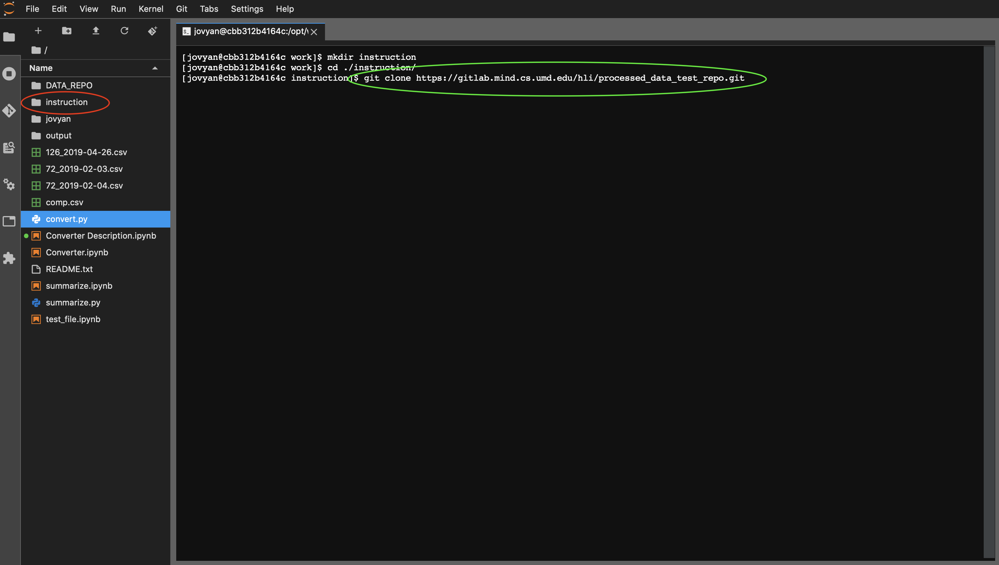

# Instruction of File Converter Tool
## Introduction
This is an instruction for the file converter tool which is a tool that made specifically for MIND Lab student researchers in breathing project. The instruction will include the basic use of the tool from the program configuration steps, command line argument usage to the final deliverables. More sepecifically, the python script of the tool will be on the **MIND Lab gitlab page**, and we will basically pull the repository containing the python script to the **MIND Lab jupyterlab**. Then the instruction will introduce how to run the tool by using command prompt on the server. Also, the output file directory selection and output file content will be mentioned as well. However, the user should have personal account from MIND Lab in order to access to MIND Lab GitLab and JupyterLab server, the basic git commands and basic UNIX commands to perform the instruction.

## Instruction
### Step 1:
Login [MIND Lab gitlab page](https://gitlab.mind.cs.umd.edu) with personal account, and find the repository named "**Haoran Li\Processed_data_test_repo**".

### Step 2:
Checkout the content of the repository by clicking the Clone button on the web page.
- Clicking the Clone button, a tab will pop up like the picture shown below.
- Then, clicking the "copy URL" button, the HTML link will then be save to pasteboard for later use.

**Note: The above picture is shown what the website looks like after clicking the "Clone" button, you can choose to clone the repo by using either SSH or HTML. However, the HTML version will be illustrated here.**

### Step 3:
Using git to clone the repository from GitLab to MIND Lab JupyterLab server.
- Switching to Mind Lab JupyterLab server, open the terminal on MIND Lab JupyterLab server.
- Creating a folder on the work directory. (Below red circle shows the example of creating the folder named "instruction")
- Using git command(The green circle below) to clone the repository URL copied from [Step2](#Step-2).
- After entering the username and password for GitLab, the repository content from the GitLab from [Step2](#Step-2) will be copied to the designated folder.

### Step 4:
Preparing the output folder before running the script.
- Switch to the directory created in [Step 3](#Step-3)(Below uses the "instruction" directory created in Step 3)
- In this directory, make a new sub-directory to take the output which will be generated from the script.(Picture below demonstrates the creation of "output" sub-directory)

**Note: Step 4-10 must be performed on the MIND Lab JupyterLab server in order to access the data on there.**

### Step 5:
Locating the input data directory on the MIND Lab JupyterLab server.
- Using the terminal to switch back to "work" directory.
- Then change directory to `./DATA_REPO/spire_prometheus2/data/`
- Browsing desired data by specific date.

- Changing directory to a specific date
- Choosing a file.
- Using UNIX command "pwd" to output the current working direcotry path to the terminal and save it for later. (Example below shows the unprocessed csv files in 2019-08-25 folder.)

### Step 6:
Running the script on a single CSV file.
- On terminal, changing directory to processed_data_test_repo under instruction directory.

- The command has 3 flags:
    - -i/--input: Input file location
    - -o/--output: Output JSON file location
    - -t/--text: Output Metadata file location
    - -h: Helper flag showing all the instructions for all flags.(Not to be used with other flag, `python convert.py -h`)
- On terminal, running convert.py by typing `python convert.py -i [INPUT_FILE] -o [OUTPUT_JSON_FOLDER] -t [OUTPUT_META_DATA_FOLDER]`(Below shows the example of command to process the `catch+256@umd.edu.csv` from the [Step 5](#Step-5) directory, and outputs the files to the folder created in [Step 4](#Step-4))

**Note: The program will ignore files that are less than 77 bytes and invalid CSV files while running**

### Step 7:
Running the script on a directory.
- Inputting a directory containing CSV files as input rather than a single CSV file. (Below passes in the script on 2019-08-25 unprocessed data directory as input.)

### Step 8:
Checking the output directory.
- Changing directory to the output folder specific from [Step 6](#Step-6), the directory tree would be like the following:
    - /output
        - 2019-08-25 (created based on the date of input data)
            - /json
            - /metadata
            - invalid_file.txt(It appears if error occurs in the specified input directory)

- The output JSON files in the sub-directory should look like below, the directory containing all the processed JSON data:

- The output matadata files in the sub-directory should look like below, the directory containing all the processed metadata in 2019-08-25:

### Step 9:
Checking the Comma-separated invalid text file if there is one.(Below is an example of invalid text file.)

### Step 10:
Shuting down the running process on the server.
- Clicking on the second symbol on the left side of the panel, the server will show all the running programs.
- Then, Clicking on "SHUT DOWN" to shut down the running process.

